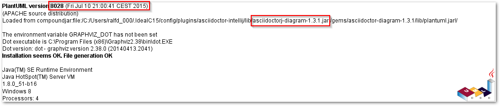

[Graphviz](http://www.graphviz.org) is cool to render diagrams and [PlantUML](https://plantuml.com) depends on Graphviz. But Graphviz is also a command line tool which needs to be installed. You can run it as portable app, but what if your company does not allow you to install Graphviz? What if you want to distribute your build but don't want to ask your users to install an additional package?

Since [April 2016](http://plantuml.com/smetana02.html), PlantUML supports rendering of diagrams without Graphviz. It is still in alpha but already working quite nice. The only drawback I currently notice is that it does not render arrow heads - something I can work with for the time being :-)

So just add

    !pragma graphviz_dot jdot
    
at top of your diagram and it will be rendered through jdot and not Graphviz dot. Just like this:

    [plantuml,jdot,png]
    ----
    !pragma graphviz_dot jdot
    class Animal
    class Cat
    class Dog
    Animal <|-- Cat
    Animal <|-- Dog
    ----

  

But there is a catch: if you are like me, you probably have several tools on your machine which use asciidoctorj and thus maybe asciidoctor-diagram. So, if the `!pragma` statement does not work in your environment, it might be that there is already an older library on the classpath which gets picked up.

Use the `version` statement of plantUML to figure this out:

    [plantuml,version,png]
    ----
    version
    ----
    
This will show you the path to the libraries used:

  
 

In my case, the [asciidoctor-intellij-plugin](https://github.com/asciidoctor/asciidoctor-intellij-plugin) was the first library found on the path. Since this is a great plugin, I used this situation to ask for an update of the plugin. Thanx to [Alexander Schwartz](https://twitter.com/ahus1de) there is already a [preview version](https://github.com/asciidoctor/asciidoctor-intellij-plugin/releases/tag/0.13-preview1) available which - in addition - renders the text and preview side-by-side!
