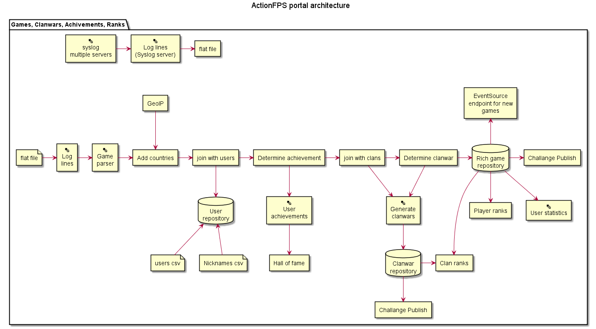

Two days ago, a plantUML tweet caught my attention:

<blockquote class="twitter-tweet" data-lang="de">
I&#39;ll pay US$15 for someone who can do this <a href="https://twitter.com/PlantUML?ref_src=twsrc%5Etfw">@PlantUML</a> or <a href="https://twitter.com/Graphviz?ref_src=twsrc%5Etfw">@Graphviz</a> diagram for <a href="https://t.co/qiHlqMk9Kv">https://t.co/qiHlqMk9Kv</a>:<a href="https://t.co/ImtOojup3d">https://t.co/ImtOojup3d</a><a href="https://twitter.com/hashtag/opensource?src=hash&amp;ref_src=twsrc%5Etfw">#opensource</a>
&mdash; William Narmontas (@ScalaWilliam) <a href="https://twitter.com/ScalaWilliam/status/924250414698053632?ref_src=twsrc%5Etfw">28. Oktober 2017</a></blockquote>

Someone is willing to pay for a plantUML diagram. 
That's something I haven't seen before, so I checked what it was all about: 
the following diagram needed to be implemented as plantUML...

The money caught my attention, but what made me to do the work was the following.
When I advise about plantUML, I always tell people that - because you don't have control over the layout - is great for sequence diagrams but hard to use for complex diagrams of other types.

Now, here it was - a complex architecture diagram and the chance to give it a try for the value of three beers! 🍺🍺🍺

 

Here is what I've learned from this:

### different tools use a different visual language
plantUML has no icon saying "these are multiple instances".
But from the names of the elements, I deducted that I could use the database symbol for the repositories and the file symbol for the csv elements.

### I was missing a visual legend
while the meaning of the csv and repository elements is clear to me, I have no clue about the color codes or the rounded shapes of the diagram.
I guess others have the same problem with my diagrams.
So always try to create a legend which explains the visual hints.

### when you have an existing diagram, you can easily describe your plantUML code to look like the original diagram
By only using the `->` (right) and `-->` (down) arrows, I already achieved most of the layout.
Sometimes I had to reverse the arrow direction `<--` to keep the meaning "down" but draw the arrow the other direction (I normally switch the two elements and do not reverse the arrow).

### but the layout can be a beast... 
Have you noticed that the plantUML consists of two images? That is because even with hidden lines, I didn't manage to put those diagrams underneath each other. PlantUML always rendered them side by side.

## Conclusion
While I managed to redraw the given diagram with plantUML, I wouldn't want to design such a diagram from scratch with plantUML, since it doesn't give you enough degrees of freedom.

While this is true for component-, class- and deployment-diagrams of a certain complexity, I really enjoy using plantUML for sequence diagrams. For sequence diagrams, it is a blessing that plantUML takes care of the layout, no matter how I change the diagram!

PS: here is a copy of the plantUML source: https://github.com/rdmueller/rdmueller.github.io/blob/master/images/ActionFPS.puml 
